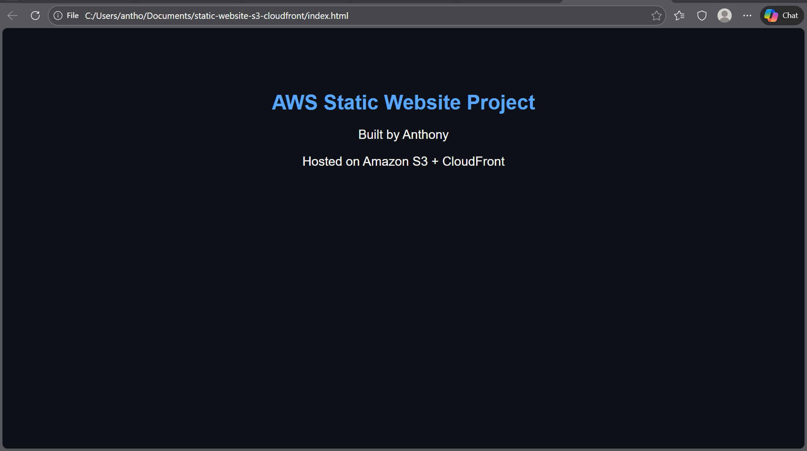
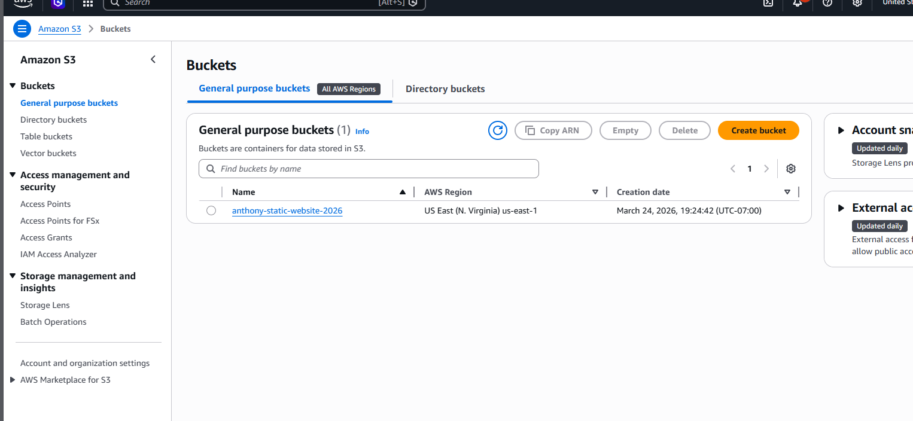
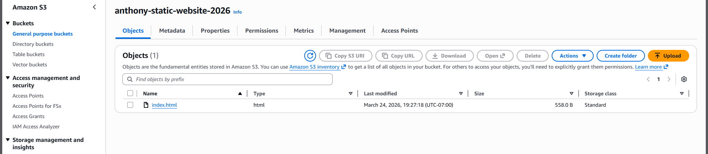
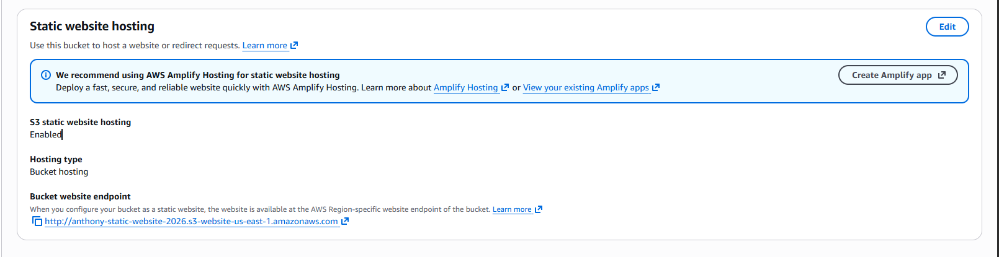
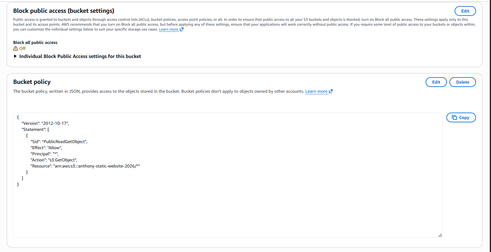
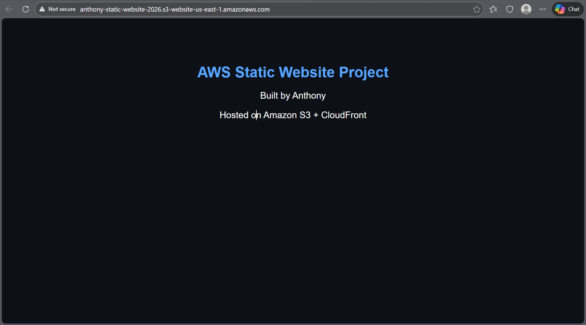
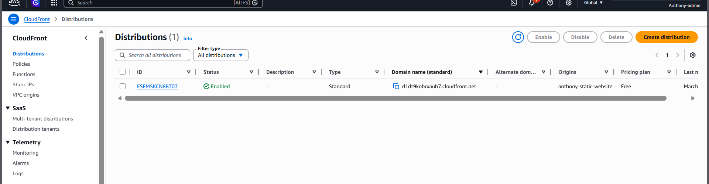
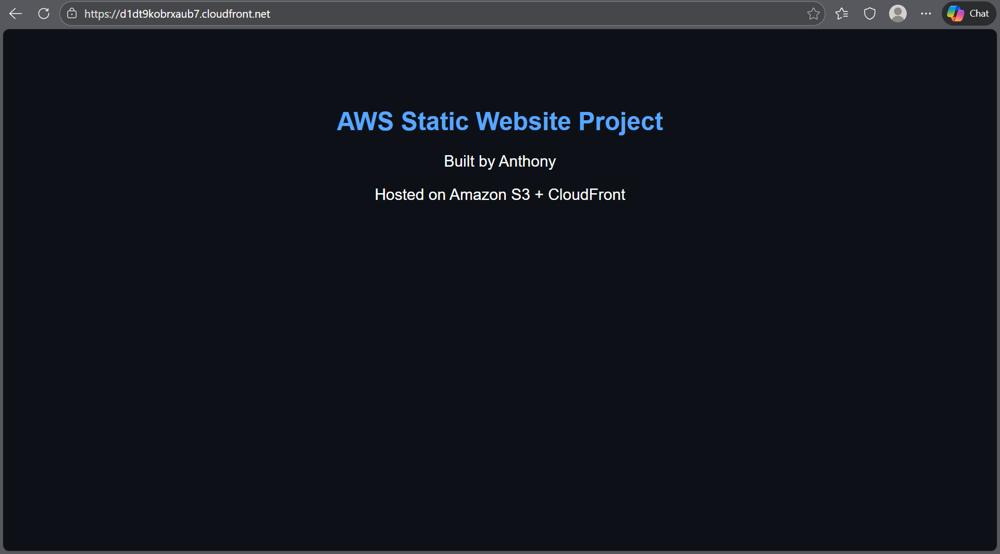

# Project 01 — Static Website on Amazon S3 + CloudFront

## Objective
Build and deploy a static website using Amazon S3 for storage and CloudFront for secure content delivery over HTTPS.
Flow: Local HTML → Amazon S3 → S3 Static Website Hosting → CloudFront
## Architecture
- Local `index.html` file created and tested in browser
- Amazon S3 bucket used to store website files
- S3 static website hosting enabled
- Bucket policy configured for public read access
- Amazon CloudFront distribution created in front of the S3 website endpoint
- Default root object set to `index.html`

## Services Used
- Amazon S3
- Amazon CloudFront

## What I Built
A basic static website hosted in Amazon S3 and delivered through CloudFront over HTTPS.

## Deployment Steps
1. Created a local project folder and `index.html`
2. Tested the HTML file locally in the browser
3. Created an S3 bucket named `anthony-static-website-2026`
4. Uploaded `index.html` to the bucket
5. Enabled S3 static website hosting
6. Disabled bucket-level Block Public Access
7. Added a bucket policy allowing public `s3:GetObject`
8. Verified the site worked through the S3 website endpoint
9. Created a CloudFront distribution using the S3 website endpoint as a custom origin
10. Set `index.html` as the default root object
11. Verified the site worked through the CloudFront URL

## Live URL
https://d1dt9kobrxaub7.cloudfront.net

## Screenshots

### 1. Local HTML file working

### 2. S3 bucket created

### 3. `index.html` uploaded to S3

### 4. Static website hosting enabled

### 5. Bucket policy configured

### 6. S3 website endpoint working

### 7. CloudFront distribution created

### 8. Final CloudFront site live

## Key Lessons Learned
- S3 website hosting and the regular S3 bucket endpoint are different
- CloudFront must use the S3 website endpoint as a custom origin for this setup
- Bucket policies and public access settings must be configured carefully
- CloudFront propagation can take time after creation or updates
- S3 can host the site, but CloudFront improves delivery and adds HTTPS

## Outcome
The website is live and publicly accessible through CloudFront over HTTPS.
